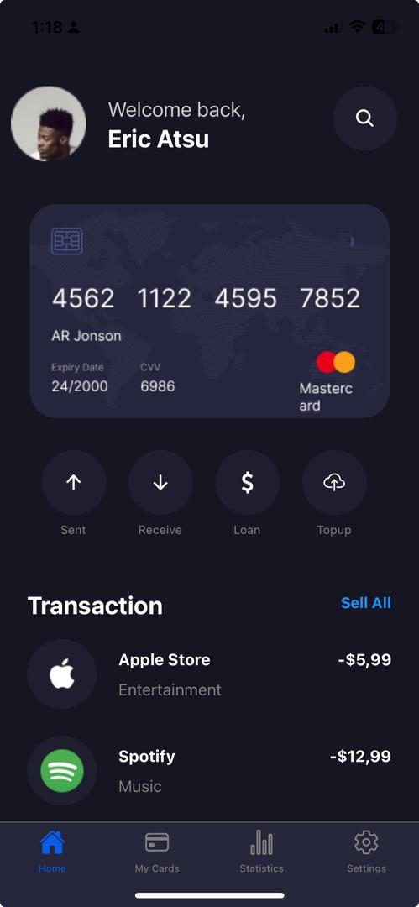
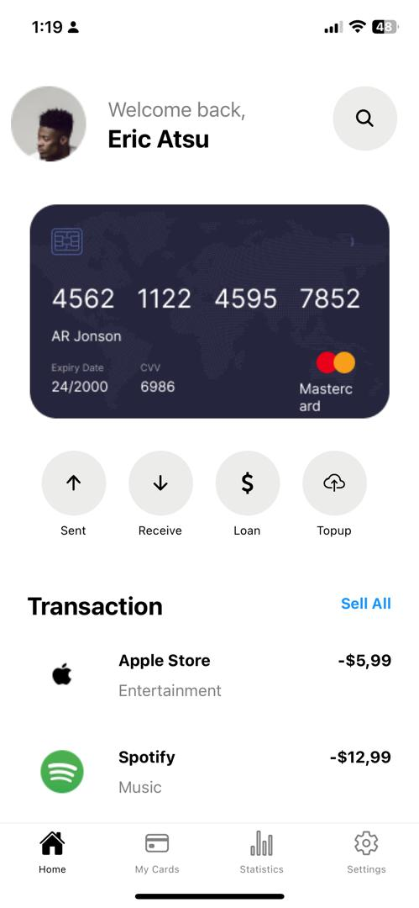
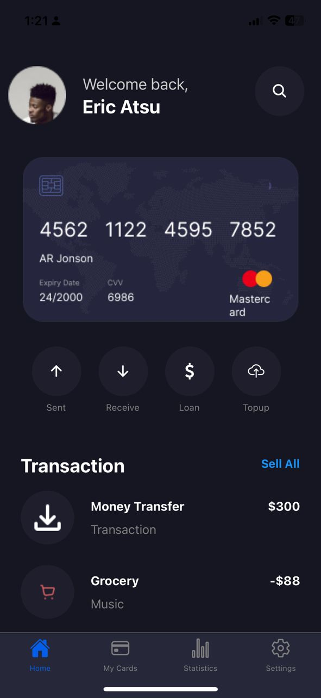
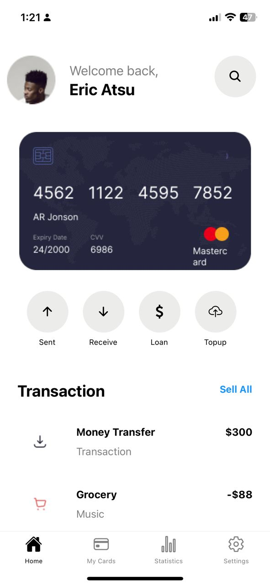
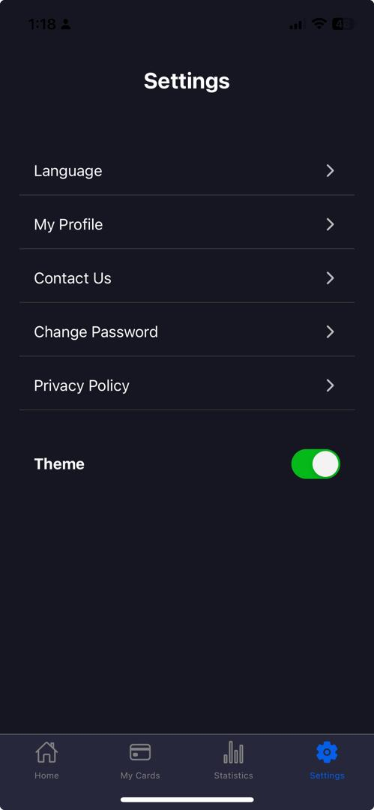
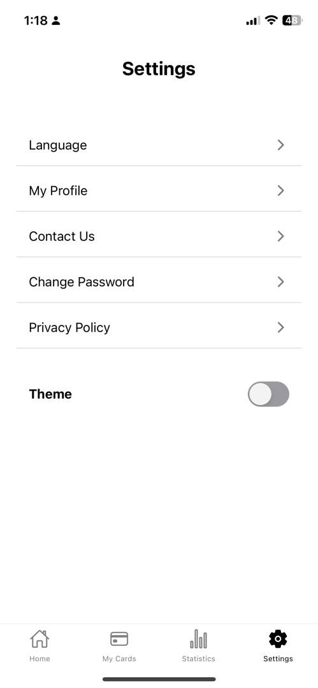

# rn-assignment5-11348827

# Elsie Loise Amegavi

Paybuddy app is an an app for transactions. It has four pages which are the `Home`,`My Cards`,`Statistics` and `Settings` page. Each page has a set of components that were used in the creation of the page. Bottom tab navigation is what is used to navigate between pages.

**Home.js** 
The `Home.js` page is where the components used for the home page can be found. The `HomeHeader.js` component contains all the code for the home page, containing the `Transaction.js` and `Card.js` components that give the home page its styling and functionalities.

**Card.js** 
This is the Card component of our React Native application. The Card component provides users with quick access to various transaction-related actions. Below are the key features provided by the Card component.

# Features:
**Send Money**: Allows users to send money to other users.
**Receive Money**: Allows users to recieve money from other users.
**Loan**: Provides an option to apply for a loan.
**Top Up**: Allows users to top up their balance.

## Theme Support
The Card component supports both light and dark themes. The appearance of the component, including the background color and text color, changes dynamically based on the selected theme.

  

## Transaction Component
This is the Transaction component of our React Native application. The Transaction component displays a list of recent transactions, providing users with a quick overview of their spending.

**Features**
**Dynamic Theming**: Supports both light and dark themes. The component's background and text colors adjust based on the current theme.
**Transaction List**: Displays a list of recent transactions with the following details:
**Title**: The name of the transaction (e.g., Apple Store, Spotify).
**Category**: The category of the transaction (e.g., Entertainment, Music).
**Amount**: The transaction amount (e.g., -$5.99, $300).
**Icon**: An icon representing the transaction, which also changes based on the theme.
**See All Button**: A button to view all transactions.

  

**Settings.js** 
    This is the settings page component where all the code is in the `Setting.js`. The settings page allows users to configure various aspects of their experience within the app. Below are the key features provided by the settings page.

# Features

**Theme Toggle**: Allows users to switch between light and dark themes.
**Language Settings**: Navigate to configure the app's language.
**Profile Management**: Navigate to view and edit user profile information.
**Contact Us**: Provides an option to contact the support team.
**Change Password**: Allows users to change their password for better security.
**Privacy Policy**: View the app's privacy policy.

# Theme Toggle
The settings page includes a switch that allows users to toggle between light and dark themes. This switch dynamically changes the appearance of the settings page and other parts of the application to match the selected theme.

  

